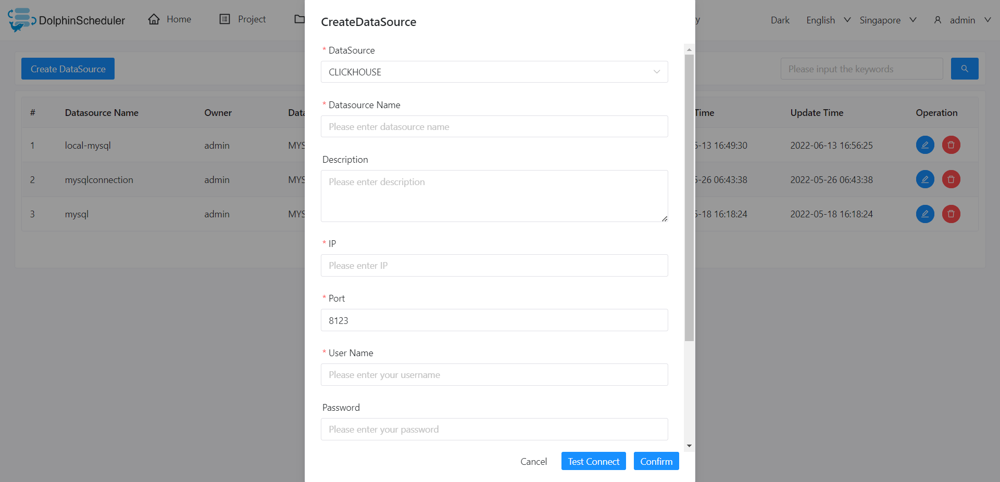

# ClickHouse

## 数据源参数

|  **数据源**  |             **描述**              |
|-----------|---------------------------------|
| 数据源       | 选择 CLICKHOUSE。                  |
| 数据源名称     | 输入数据源的名称。                       |
| 描述        | 输入数据源的描述。                       |
| IP/主机名    | 输入 CLICKHOUSE 服务的 IP。           |
| 端口        | 输入 CLICKHOUSE 服务的端口。            |
| 用户名       | 设置 CLICKHOUSE 连接的用户名。           |
| 密码        | 设置 CLICKHOUSE 连接的密码。            |
| 数据库名      | 输入 CLICKHOUSE 连接的数据库名称。         |
| JDBC 连接参数 | CLICKHOUSE 连接的参数设置，以 JSON 格式填写。 |

## 是否原生支持

- 否，在阅读 [伪集群](../installation/pseudo-cluster.md) `下载插件依赖` 部分的示例来激活此数据源。
- 驱动下载链接 [clickhouse-jdbc-0.4.6](https://repo1.maven.org/maven2/com/clickhouse/clickhouse-jdbc/0.4.6/clickhouse-jdbc-0.4.6.jar)

