# 参数优先级

DolphinScheduler 中所涉及的参数值可能来自以下六种类型：

* [内置参数](built-in.md)：在系统中内置的参数
* [项目级别参数](project-parameter.md)：在项目管理中定义的项目级别参数
* [全局参数](global.md)：在工作流保存页面定义时定义的变量
* [启动参数](startup-parameter.md)：在工作流启动页面定义的变量
* [上游任务传递的参数](context.md)：上游任务传递过来的参数
* [本地参数](local.md)：节点的自有变量，用户在“自定义参数”定义的变量，并且用户可以在工作流定义时定义该部分变量的值

由于参数值存在多个来源，当参数名称相同时，就会存在参数优先级的问题。DolphinScheduler 参数的优先级从高到低为：`上游任务传递的参数 > 启动参数 > 本地参数 > 全局参数 > 项目级别参数 > 内置参数`

在上游任务传递的参数中，由于上游可能存在多个任务向下游传递参数，当上游传递的参数名称相同时：

* 下游节点会优先使用值为非空的参数
* 如果存在多个值为非空的参数，则按照上游任务的完成时间排序，选择完成时间最晚的上游任务对应的参数

## 例子

下面的示例展示任务参数优先级的使用：

1：先以 Shell 节点解释第一种情况

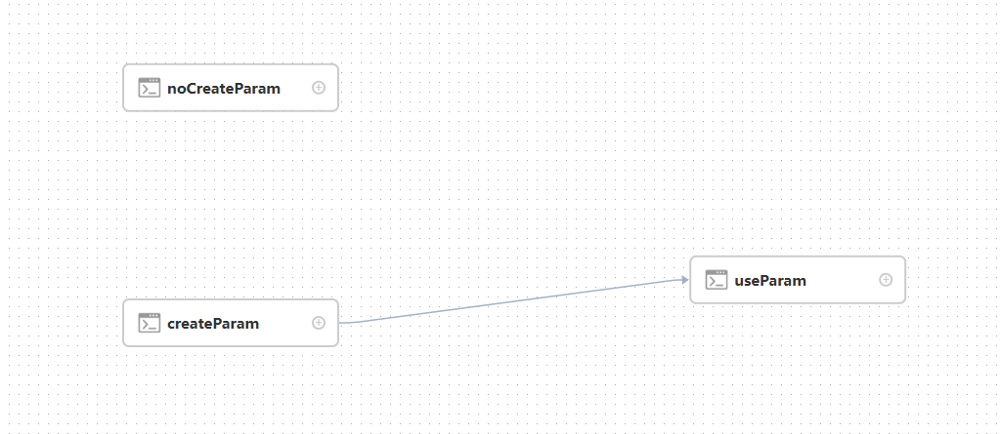

节点 【useParam】可以使用到节点【createParam】中设置的变量。而节点 【useParam】与节点【noCreateParam】中并没有依赖关系，所以并不会获取到节点【noCreateParam】的变量。上图中只是以 shell 节点作为例子，其他类型节点具有相同的使用规则。

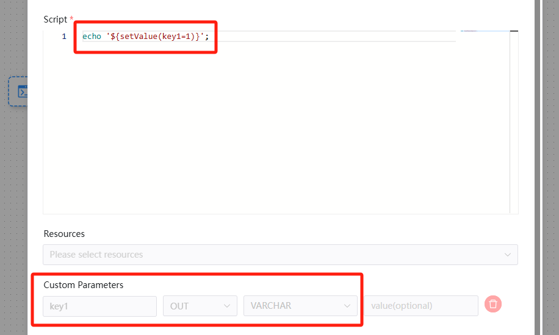

节点【createParam】创建了一个名为 'key1' 的输出（OUT）参数，并将其赋值为 '1'。

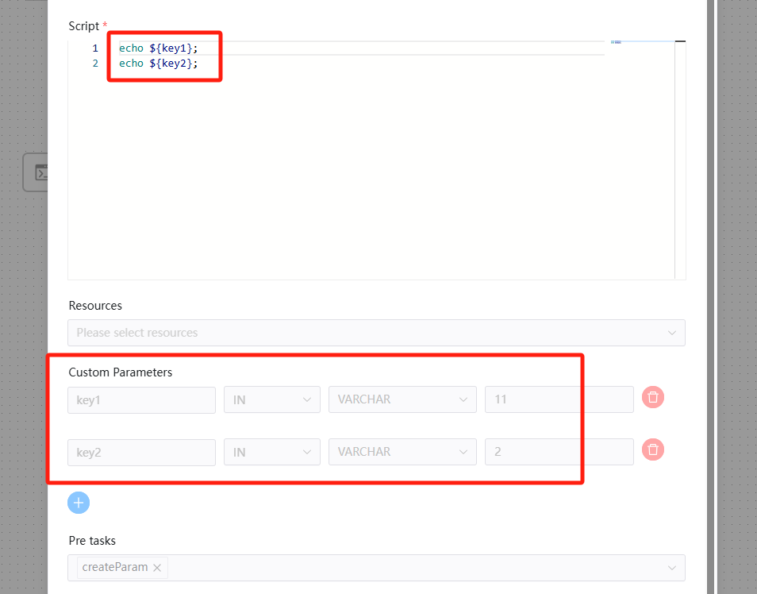

节点【useParam】创建了两个分别名为 'key1' 和 'key2' 的参数。其中 'key1' 与上游节点传递的参数同名，并被赋值为 '11'。然而，根据优先级规则，该节点内部本地参数的值 '11' 会被丢弃，最终生效的赋值将是上游节点传递过来的值 '1'。

2：我们再以 Shell 和 SQL 节点来解释复杂的组合案例

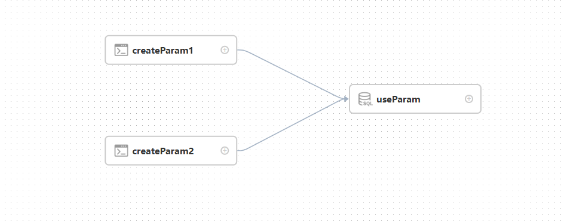

以下是节点【createParam1】的定义：

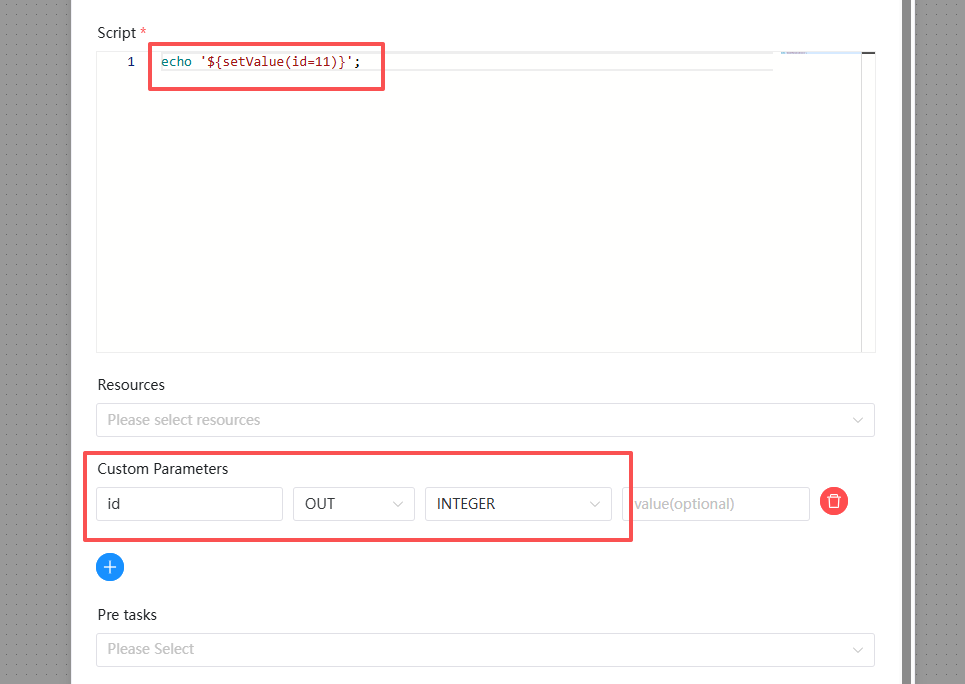

节点【createParam1】创建了一个名为 'id' 的输出（OUT）参数，并将其赋值为 '11'。

以下是节点【createParam2】的定义：

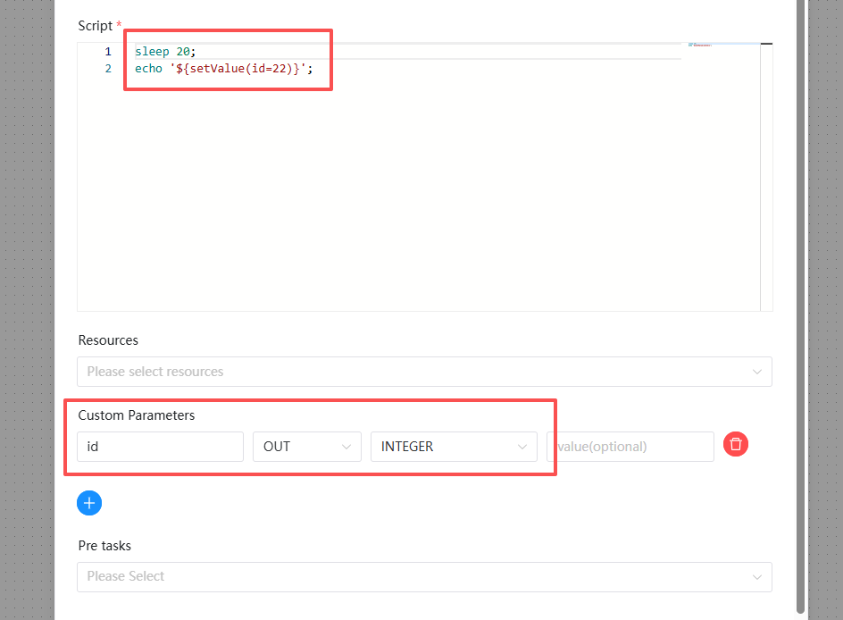

节点【createParam2】创建了一个名为 'id' 的输出（OUT）参数，并将其赋值为 '22'。该节点中加入了 "sleep 20" 的逻辑，以确保它在节点【createParam1】之后执行完成。

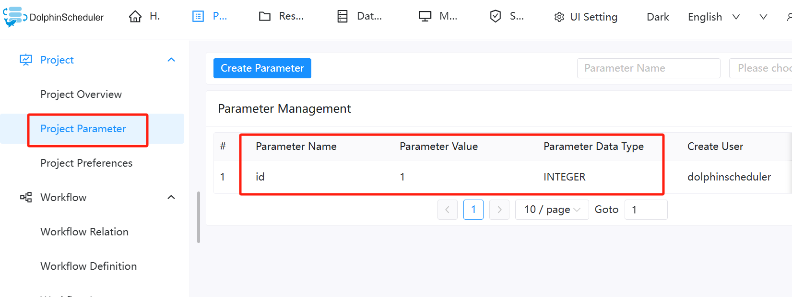

'id' 是一个项目级参数，其被赋值为 '1'。

以下是节点【useParam】的定义：

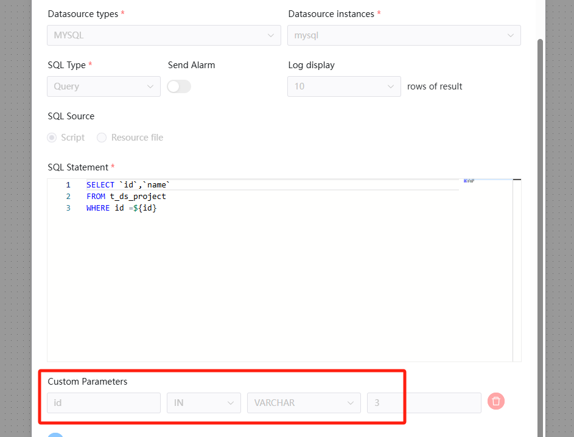

'id' 也是该节点自身的参数，由当前节点赋值为 '3'（即本地参数）。

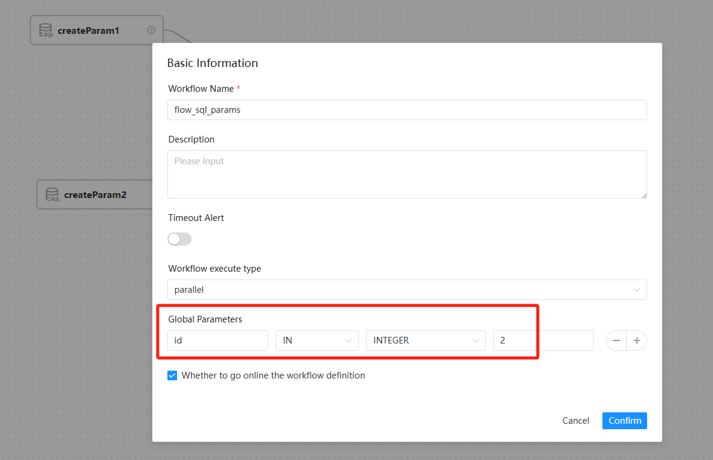

然而，用户在保存流程定义时也设置了 'id' 参数（全局参数），并将其赋值为 2。

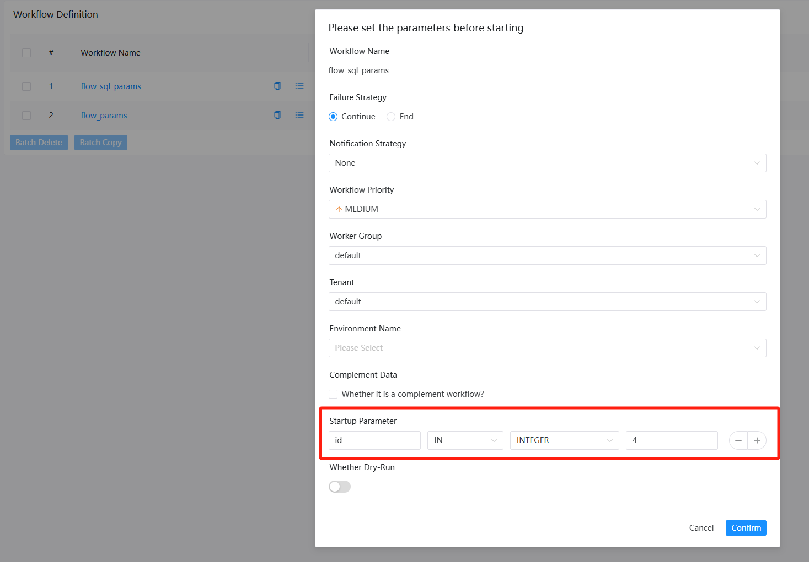

'id' 可以在任务启动页面上进行配置（启动参数），并将其赋值为 4。

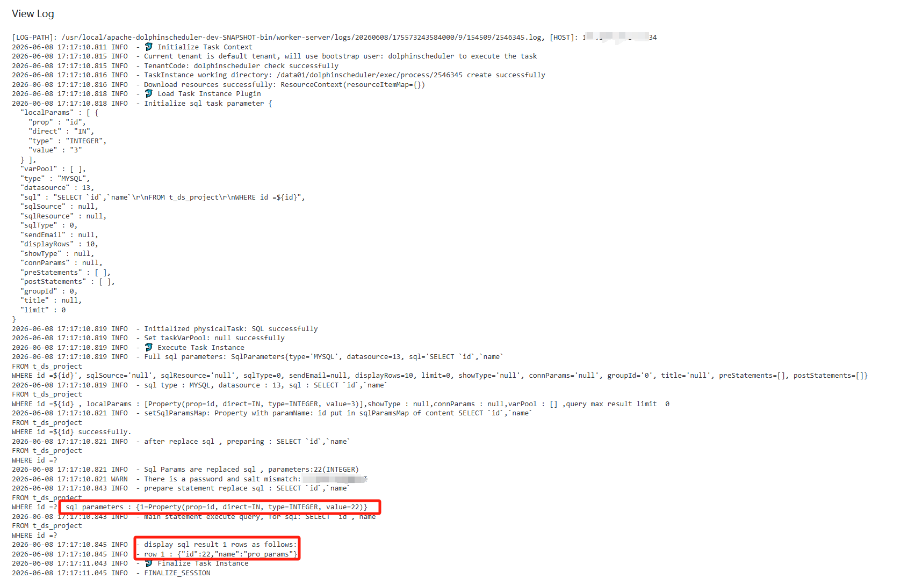

执行结果符合预期，其中参数上下文（Parameter Context）具有最高优先级。用户为节点【createParam1】和节点【createParam2】设置了同名参数 'id'，而节点【useParam】使用了后执行完成的节点【createParam2】的值 '22'。
