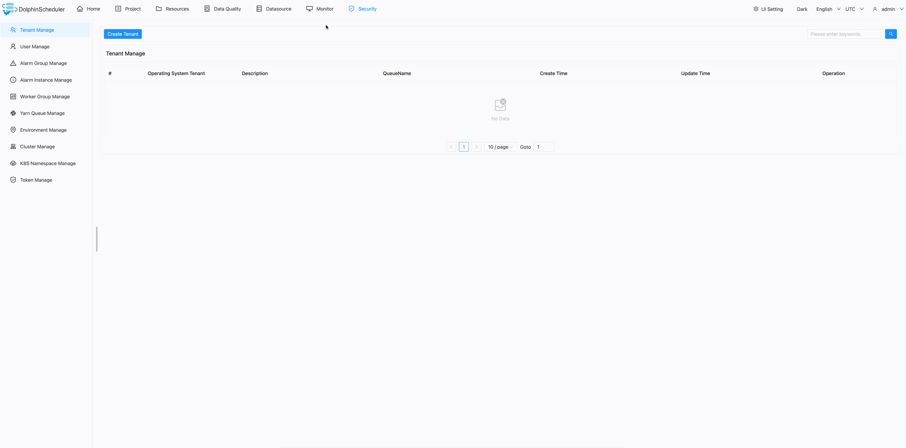
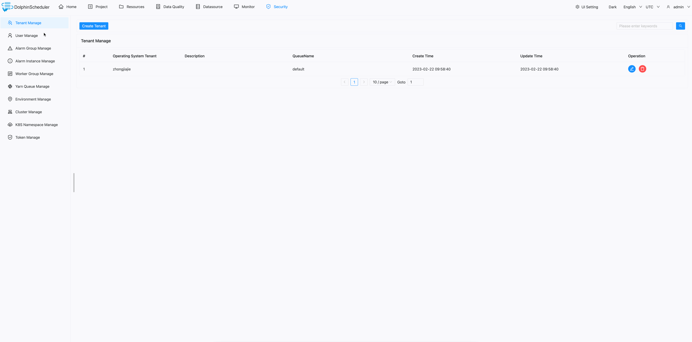
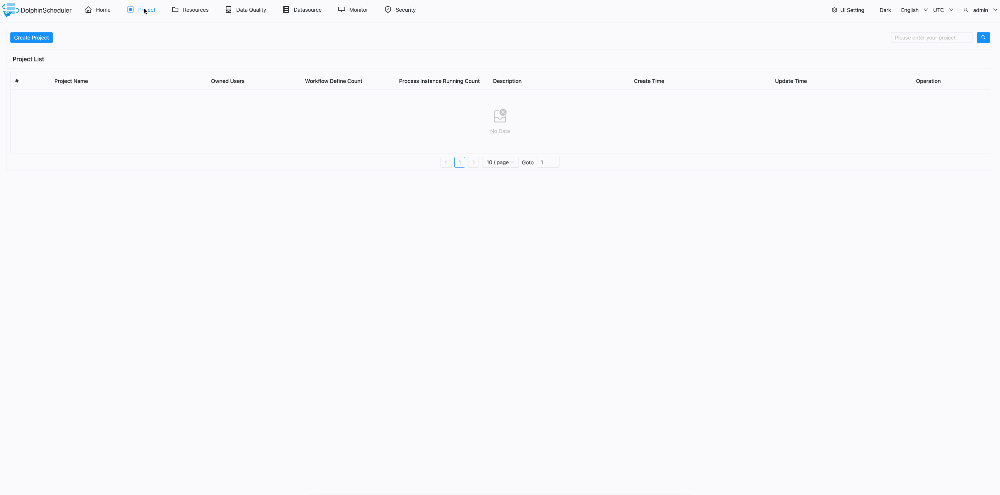
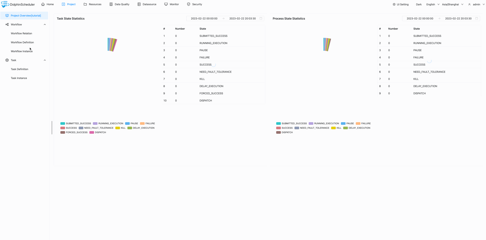
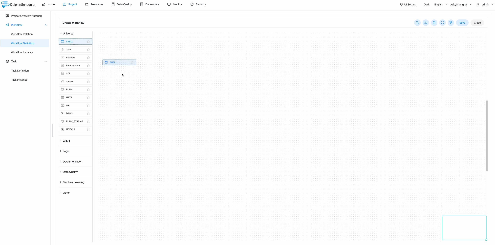
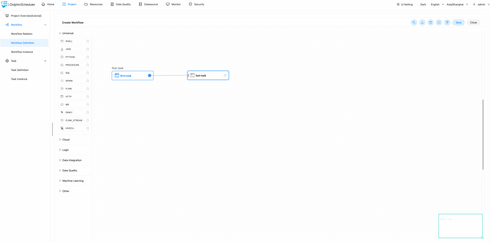
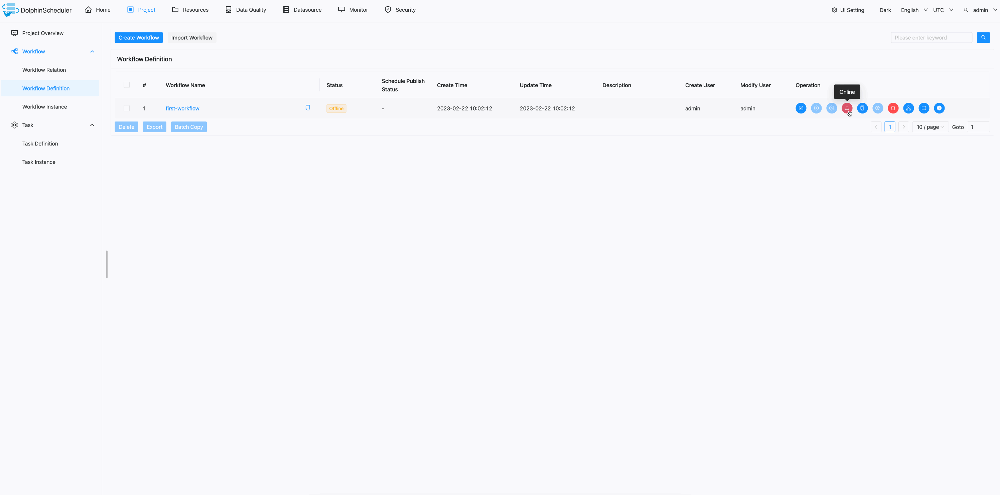
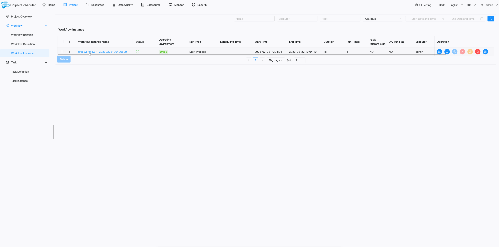

# 快速上手

在本节中，我们将使用 DolphinScheduler 逐步创建和运行一个简单的工作流。在这段旅程中，你将学习 DolphinScheduler 的基本概念，并了解运行工作流的最基本配置。我们在本教程中提供了视频和文字两种方式，你可以选择喜欢的方式。

## 视频教程

## 图文教程

### 设置 Dolphinscheduler

在继续之前，你必须先安装并启动 DolphinScheduler。对于初学者，我们建议使用官方 Docker 镜像或 Standalone 服务器来部署 DolphinScheduler。

* [standalone server](../installation/standalone.md)
* [docker](./docker.md)

### 构建您的第一个工作流程

你可以使用默认用户名和密码 `admin/dolphinscheduler123` 登录 DolphinScheduler，访问地址为 http://localhost:12345/dolphinscheduler/ui 。

#### 创建租户

租户（Tenant）是使用 DolphinScheduler 时绕不开的一个概念，所以先简单介绍一下租户的概念。

在 DolphinScheduler 中，登录使用的 admin 账户称为用户（User）。为了更好地控制系统资源，DolphinScheduler 引入了租户（Tenant）的概念，用于实际执行任务。

简述如下：

- **用户**：登录 Web UI，在 Web UI 中进行所有操作，包括工作流管理和租户创建。
- **租户**：任务的实际执行者，是 DolphinScheduler Worker 运行任务时使用的 Linux 用户。

我们可以在 DolphinScheduler 的`安全中心 -> 租户管理`页面创建租户。

> 注意：如果没有关联租户，则会使用默认租户。默认租户为 default，会使用程序启动用户执行任务。

#### 将租户分配给用户

正如我们在上面`创建租户`部分谈到的，用户只有被分配了租户后才能运行任务。

我们可以在 DolphinScheduler 的`安全中心 -> 用户管理`页面中将租户分配给特定用户。

创建租户并将其分配给用户后，我们就可以开始在 DolphinScheduler 中创建一个简单的工作流了。

#### 创建项目

但是在 DolphinScheduler 中，所有的工作流都必须属于一个项目，所以我们需要首先创建一个项目。

我们可以在 DolphinScheduler 的`项目管理`页面，点击`创建项目`按钮来创建项目。

#### 创建工作流

现在我们可以为项目 "tutorial" 创建一个工作流。点击我们刚刚创建的项目，进入`工作流定义`页面，点击`创建工作流`按钮，我们将跳转到工作流详情页面。

#### 创建任务

我们可以使用鼠标从工作流画布的工具栏中拖动要创建的任务。在这种情况下，我们创建一个 `Shell` 任务。输入任务的必要信息，对于这个简单的工作流，我们只需将属性`节点名称`填写为`脚本`即可。之后，我们可以点击`保存`按钮将任务保存到工作流中。我们使用相同的方式创建另一个任务。

#### 设置任务依赖

这样，我们在工作流中有两个不同名称和命令的任务。当前工作流中唯一缺少的是任务依赖关系。我们可以使用鼠标将箭头从上游任务拖到下游任务来添加依赖，然后松开鼠标。你可以看到两个任务之间创建了带箭头的链接，从上游任务指向下游任务。最后，我们可以点击右上角的`保存`按钮保存工作流，不要忘记填写工作流名称。

#### 运行工作流

全部完成后，我们可以在工作流列表中点击`上线`，然后点击`运行`按钮来运行工作流。如果你想查看工作流实例，只需进入`工作流实例`页面，可以看到工作流实例正在运行，状态为`执行中`。

#### 查看日志

如需查看任务日志，请点击工作流实例列表中的工作流实例，然后找到要查看日志的任务，右键点击选择`查看日志`，你可以看到任务的详细日志。

你可以在日志中看到打印的 `Hello DolphinScheduler` 和 `Ending...`，这与我们在创建任务时定义的内容一致。

恭喜你！你刚刚完成了 DolphinScheduler 的第一个教程，现在可以在 DolphinScheduler 中运行一些简单的工作流了！
