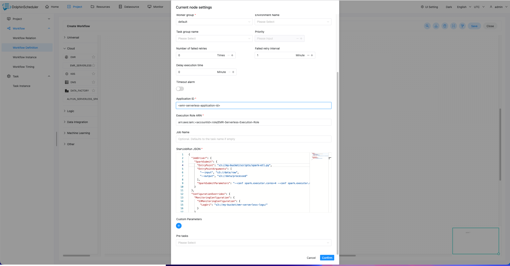

# Amazon EMR Serverless

## 综述

Amazon EMR Serverless 任务类型，用于向 [Amazon EMR Serverless](https://docs.aws.amazon.com/emr/latest/EMR-Serverless-UserGuide/emr-serverless.html) 应用程序提交并监控作业运行。
与传统的 EMR on EC2 不同，EMR Serverless 无需管理集群基础设施，按需自动扩缩容计算资源，适用于 Spark 和 Hive 工作负载。

后台使用 [aws-java-sdk](https://aws.amazon.com/cn/sdk-for-java/) 将 JSON 参数转换为 [StartJobRunRequest](https://docs.aws.amazon.com/AWSJavaSDK/latest/javadoc/com/amazonaws/services/emrserverless/model/StartJobRunRequest.html) 对象，
通过 [StartJobRun API](https://docs.aws.amazon.com/emr-serverless/latest/APIReference/API_StartJobRun.html) 提交到 AWS，并通过 [GetJobRun API](https://docs.aws.amazon.com/emr-serverless/latest/APIReference/API_GetJobRun.html) 轮询作业状态直到完成。

## 创建任务

- 点击 `项目管理 -> 项目名称 -> 工作流定义`，点击 `创建工作流` 按钮进入 DAG 编辑页面。
- 从工具栏中拖拽 `AmazonEMRServerless` 任务到画布中完成创建。

## 任务参数

[//]: # (TODO: use the commented anchor below once our website template supports this syntax)
[//]: # (- 默认参数说明请参考[DolphinScheduler任务参数附录]&#40;appendix.md#默认任务参数&#41;`默认任务参数`一栏。)

- 默认参数说明请参考[DolphinScheduler任务参数附录](appendix.md)`默认任务参数`一栏。

|        **任务参数**         |                                                                                                                                        **描述**                                                                                                                                        |
|-------------------------|--------------------------------------------------------------------------------------------------------------------------------------------------------------------------------------------------------------------------------------------------------------------------------------|
| Application Id          | EMR Serverless 应用程序 ID（格式如 `00fkht2eodujab09`），可在 [EMR Serverless 控制台](https://console.aws.amazon.com/emr/home#/serverless) 获取                                                                                                                                                       |
| Execution Role Arn      | 作业执行 IAM 角色的 ARN（格式如 `arn:aws:iam::123456789012:role/EMRServerlessRole`），该角色需要有访问 S3、Glue 等服务的权限                                                                                                                                                                                     |
| Job Name                | 作业名称（可选），用于在 EMR Serverless 控制台中标识作业                                                                                                                                                                                                                                                 |
| StartJobRunRequest JSON | [StartJobRunRequest](https://docs.aws.amazon.com/AWSJavaSDK/latest/javadoc/com/amazonaws/services/emrserverless/model/StartJobRunRequest.html) 中 `JobDriver` 和 `ConfigurationOverrides` 部分对应的 JSON，详细定义见下方示例。**注意**：`ApplicationId` 和 `ExecutionRoleArn` 无需在 JSON 中重复填写，系统会自动从上方参数注入 |



## 任务样例

### 提交 Spark 作业

该样例展示了如何创建 `EMR_SERVERLESS` 任务节点来提交一个 Spark 作业到 EMR Serverless 应用程序。

StartJobRunRequest JSON 参数样例（Spark）：

```json
{
  "JobDriver": {
    "SparkSubmit": {
      "EntryPoint": "s3://my-bucket/scripts/my-spark-job.jar",
      "EntryPointArguments": [
        "s3://my-bucket/input/",
        "s3://my-bucket/output/"
      ],
      "SparkSubmitParameters": "--class com.example.MySparkApp --conf spark.executor.cores=4 --conf spark.executor.memory=8g --conf spark.executor.instances=10"
    }
  },
  "ConfigurationOverrides": {
    "MonitoringConfiguration": {
      "S3MonitoringConfiguration": {
        "LogUri": "s3://my-bucket/emr-serverless-logs/"
      }
    }
  }
}
```

### 提交 Hive 作业

该样例展示了如何创建 `EMR_SERVERLESS` 任务节点来提交一个 Hive 查询作业。

StartJobRunRequest JSON 参数样例（Hive）：

```json
{
  "JobDriver": {
    "HiveSQL": {
      "Query": "s3://my-bucket/scripts/my-hive-query.sql",
      "Parameters": "--hiveconf hive.exec.dynamic.partition=true --hiveconf hive.exec.dynamic.partition.mode=nonstrict"
    }
  },
  "ConfigurationOverrides": {
    "MonitoringConfiguration": {
      "S3MonitoringConfiguration": {
        "LogUri": "s3://my-bucket/emr-serverless-logs/"
      }
    },
    "ApplicationConfiguration": [
      {
        "Classification": "hive-site",
        "Properties": {
          "hive.metastore.client.factory.class": "com.amazonaws.glue.catalog.metastore.AWSGlueDataCatalogHiveClientFactory"
        }
      }
    ]
  }
}
```

## AWS 认证配置

EMR Serverless 任务通过 DolphinScheduler 的 `aws.yaml` 配置文件读取 AWS 认证信息，配置路径为 `conf/aws.yaml` 中的 `aws.emr` 段。

### 使用 IAM Role（推荐）

如果 DolphinScheduler Worker 节点运行在 EC2 实例上并已绑定 IAM Role，配置如下：

```yaml
aws:
  emr:
    credentials.provider.type: InstanceProfileCredentialsProvider
    region: us-east-1
```

### 使用 Access Key

如果需要使用 AK/SK 方式认证：

```yaml
aws:
  emr:
    credentials.provider.type: AWSStaticCredentialsProvider
    access.key.id: your-access-key-id
    access.key.secret: your-secret-access-key
    region: us-east-1
```

> **注意**：`aws.emr` 段的配置同时被 EMR on EC2 和 EMR Serverless 任务类型共享。

## 作业状态流转

EMR Serverless 作业提交后，DolphinScheduler 会每 10 秒轮询一次作业状态：

```
SUBMITTED → PENDING → SCHEDULED → RUNNING → SUCCESS
                                           → FAILED
                                           → CANCELLED
```

- 作业进入 `SUCCESS` 状态时，任务标记为成功
- 作业进入 `FAILED` 或 `CANCELLED` 状态时，任务标记为失败
- 如果 DolphinScheduler 任务被终止，会自动调用 [CancelJobRun API](https://docs.aws.amazon.com/emr-serverless/latest/APIReference/API_CancelJobRun.html) 取消正在运行的作业

## 注意事项

- **Application Id** 对应的 EMR Serverless 应用程序需要预先在 AWS 控制台或通过 API 创建，并确保处于 `STARTED` 或 `CREATED` 状态
- **Execution Role** 需要有以下最小权限：`emr-serverless:StartJobRun`、`emr-serverless:GetJobRun`、`emr-serverless:CancelJobRun`，以及作业所需的 S3、Glue 等数据访问权限
- `StartJobRunRequest JSON` 中无需填写 `ApplicationId` 和 `ExecutionRoleArn` 字段，系统会自动从表单参数注入
- EMR Serverless 任务支持故障转移（Failover）：当 Worker 节点发生故障时，新的 Worker 可以通过 `appIds`（即 `jobRunId`）恢复对正在运行作业的跟踪

